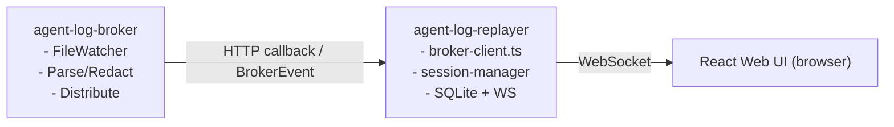

[日本語版はこちら / Japanese](README-ja.md)

# agent-log-replayer

Browser-based LLM session replayer — **TypeScript, React, SQLite.**

Consumes events from [agent-log-broker](../agent-log-broker/) and replays AI agent sessions in real time with playback controls, terminal rendering, timeline visualization, and security audit.

> **agent-log-replayer** sits at the end of the pipeline: broker detects → broker distributes → replayer persists and plays back.

---

## Table of Contents

- [Why agent-log-replayer exists](#why-agent-log-replayer-exists)
- [Quick Start](#quick-start)
- [Architecture Overview](#architecture-overview)
- [Broker Integration](#broker-integration)
- [SQLite Storage](#sqlite-storage)
- [WebSocket / REST API](#websocket--rest-api)
- [Renderer](#renderer)
- [Security Audit](#security-audit)
- [Frontend Components](#frontend-components)
- [Configuration](#configuration)
- [Known Issues / Backlog](#known-issues--backlog)
- [Tests](#tests)
- [Relation to claude-session-replay](#relation-to-claude-session-replay)

---

## Why agent-log-replayer exists

```
Agent session runs
  → broker detects log events, redacts, distributes
  → replayer receives, persists to SQLite, streams to browser
  → browser replays the session frame-by-frame with audit data
```

The core value: **you don't need to read raw log files**. The replayer gives you a structured, seekable, auditable view of what the agent did — while it is still running, or after it finishes.

---

## Quick Start

### Prerequisites

- Node.js ≥ 20
- [agent-log-broker](../agent-log-broker/) running on `http://localhost:3100`

### Install & run

```bash
npm install
npm run build
npm start
```

Open `http://localhost:3200` in your browser.

### Development mode

```bash
# Terminal 1 — backend
npm run dev

# Terminal 2 — frontend (Vite dev server)
npm run dev:frontend
```

---

## Architecture Overview

Three layers:

```mermaid
flowchart TB
    L1["Layer 1 — Consumer<br/>broker-client.ts: subscribes to agent-log-broker (full_stream mode)<br/>session-manager.ts: maintains per-session state in memory"]
    L2["Layer 2 — Storage<br/>session-store.ts: persists sessions + messages + security events to SQLite"]
    L3["Layer 3 — UI<br/>routes.ts: REST API (sessions, timeline, status)<br/>websocket.ts: WebSocket real-time event streaming<br/>React SPA: SessionList / SessionPlayer / TerminalView / TimelineView / SecurityPanel"]
    L1 -->|BrokerEvent (HTTP callback)| L2
    L2 -->|query + realtime notify| L3
```

See [docs/architecture.md](docs/architecture.md) for full detail.

---

## Broker Integration

agent-log-replayer registers as a **consumer** of agent-log-broker with `mode: full_stream`.



### BrokerEvent types

| Type | Action |
|------|--------|
| `session.discovered` | Create session record in memory + SQLite |
| `message` | Append message, persist, broadcast via WebSocket |
| `session.idle` | Update session status to `idle` |
| `session.lost` | Update session status to `lost` |

### WARNING — BrokerEvent type duplication risk

`BrokerEvent` and `AgentMessage` are **locally redefined** in `src/consumer/broker-client.ts`. They must stay in sync with the broker's canonical type definitions. If the broker adds or changes fields, this file must be updated manually.

See [docs/decisions/broker-event-type-duplication.md](docs/decisions/broker-event-type-duplication.md) for the full context and resolution options.

---

## SQLite Storage

Sessions, messages, and security events are persisted to SQLite via `better-sqlite3` (synchronous API, WAL mode).

**Tables:**

| Table | Description |
|-------|-------------|
| `sessions` | Session metadata (status, agentType, projectPath, message counts) |
| `messages` | All messages ordered by `message_index` per session |
| `security_events` | Security flags and banned word hits per session |

Previously seen sessions are persisted in SQLite. Note that startup restoration via `SessionManager.loadFromStore()` is not currently wired into the server entry point, so they do not appear in the in-memory session list until restoration is implemented.

---

## WebSocket / REST API

### REST

| Method | Path | Description |
|--------|------|-------------|
| `GET` | `/api/sessions` | List all sessions |
| `GET` | `/api/sessions/:id` | Session detail with messages |
| `GET` | `/api/sessions/:id/timeline` | Timeline events |
| `GET` | `/api/status` | Health check + broker connection |
| `POST` | `/api/broker/callback` | Receive BrokerEvent from broker |

### WebSocket (`ws://host:3200/ws`)

**Server → client:**

```json
{ "type": "event",        "sessionId": "...", "event": { /* BrokerEvent */ } }
{ "type": "session.list", "sessions": [ /* SessionSummary[] */ ] }
{ "type": "error",        "message": "..." }
```

**Client → server:**

```json
{ "type": "subscribe",   "sessionId": "..." }
{ "type": "unsubscribe" }
```

---

## Renderer

Three server-side renderer modules convert raw `AgentMessage` data into display-ready formats:

| Module | Output |
|--------|--------|
| `terminal-renderer.ts` | ANSI escape sequences for xterm.js terminal replay |
| `timeline-renderer.ts` | Structured timeline event list (tool calls, messages, status changes) |
| `diff-renderer.ts` | File diff visualization for Edit/Write tool events |

The terminal renderer reuses visual conventions from `claude-session-replay`:
- User messages: `>` prompt with blue background
- Assistant text: orange left border
- Tool blocks: tool-specific icons (📄 Read, 📝 Write, ✏️ Edit, `$` Bash, …)

---

## Security Audit

`src/security/audit.ts` aggregates security flags and banned word hits received from the broker. The broker performs detection; the replayer handles presentation.

```typescript
interface SecurityFlag {
  type: string;
  severity: "info" | "warning" | "critical";
  description: string;
  messageIndex?: number;
}

interface BannedWordHit {
  word: string;
  context: string;
  messageIndex: number;
  field: string;
}
```

`requiresReview(summary)` returns `true` if any `critical` flags or banned word hits are present.

---

## Frontend Components

| Component | Status | Description |
|-----------|--------|-------------|
| `SessionList` | Implemented | Lists all sessions with status badges |
| `SessionPlayer` | Implemented | Playback controls (play/pause, seek, speed) |
| `TerminalView` | **TODO placeholder** | xterm.js terminal — not yet wired to session store |
| `TimelineView` | **TODO placeholder** | Timeline events — not yet fetching from API |
| `SecurityPanel` | **TODO placeholder** | Security flags display — not yet wired to session store |

The three placeholder components render static UI shells with `// TODO` comments indicating the wiring needed. They are intentionally incomplete.

---

## Configuration

| Variable | Default | Description |
|----------|---------|-------------|
| `PORT` | `3200` | HTTP/WebSocket server port |
| `BROKER_URL` | `http://localhost:3100` | agent-log-broker URL |
| `CALLBACK_URL` | `http://localhost:3200/api/broker/callback` | Callback URL registered with broker |
| `DB_PATH` | `./data/sessions.db` | SQLite database path |

---

## Known Issues / Backlog

### BACKLOG — consumerId changes on every restart

`BrokerClient` generates `consumerId` as `` `agent-log-replayer-${Date.now()}` `` when no explicit ID is provided. This means every restart registers as a **new consumer** with the broker. Old subscriptions are never cleaned up.

**Impact:** The broker accumulates stale consumer records. After many restarts, delivery may be attempted to dead callbacks.

**Workaround:** Set a stable `consumerId` via environment variable or persist it to `./data/consumer-id.json`.

See [docs/decisions/consumer-id-instability.md](docs/decisions/consumer-id-instability.md).

---

## Tests

The test suite currently contains 53 tests across six test files (including MCP e2e). Run them with `npm test -- --run`.

---

## MCP

This service is an MCP backend for the [volta-mcp](https://github.com/opaopa6969/volta-mcp) facade.

- **namespace:** `replay`
- **endpoint:** `http://<host>:3200/mcp` (Streamable HTTP)
- **health:** `http://<host>:3200/healthz`
- **spec:** `replay://spec` (machine-readable capabilities)
- **guide:** `replay://guide` (usage guide)
- **tools:** `list_sessions`, `get_session`, `get_timeline`, `status`, `audit_summary` (all read-only)
- **min_role:** MEMBER

See `docs/mcp/DESIGN.md` for the full design and `docs/skills/replay-ingest/SKILL.md` for the ingest procedure.

---

## Relation to claude-session-replay

| Aspect | claude-session-replay | agent-log-replayer |
|--------|-----------------------|-------------------|
| Data source | Reads log files directly | Receives from agent-log-broker |
| Parsing | Own adapters (Python) | Broker handles parsing |
| UI | Flask + standalone HTML | React SPA + WebSocket |
| Session state | File-based (re-scanned each time) | SQLite + real-time update |
| Live display | None (post-completion only) | Real-time via WebSocket |

Concepts inherited: data model, terminal rendering style, playback modes, security flag taxonomy.

---

## Tech Stack

| Layer | Technology |
|-------|-----------|
| Server | TypeScript, Express, ws (WebSocket) |
| Frontend | React, Zustand, xterm.js |
| Storage | SQLite (better-sqlite3, WAL mode) |
| Transport | HTTP callback (broker → replayer), WebSocket (replayer → browser) |
| Build | Vite, TypeScript, tsx |
