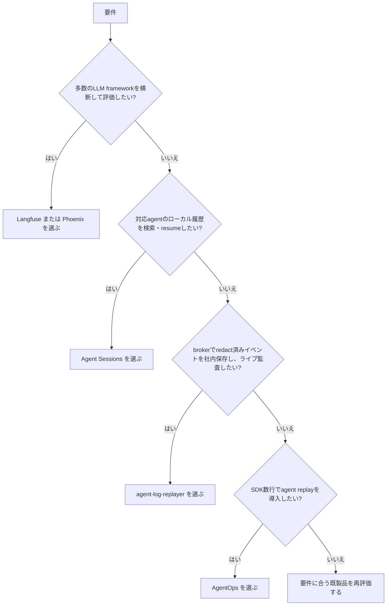

# agent-log-replayer 市場調査

## 0. 要約

立ち位置: `agent-log-broker` と組み合わせ、ローカルのLLMエージェント実行を SQLite に保存してブラウザで追跡・再生・監査する、軽量な self-hosted 部品である。

最大の弱点: 主要な再生画面（Terminal / Timeline / Security）はまだ placeholder で、監査データも SQLite に永続化されていない。

次の一手: まず「一つのイベントを、保存済みの証跡付きで最後まで再生・検索できる」縦切りを完成させ、次に標準化された取り込み境界を作る。

## 1. このrepoは何か

一言でいえば、`agent-log-broker` のイベントを受け取るブラウザベースのLLMセッションリプレイヤーである。brokerが検知・redact・配信し、本repoは `POST /api/broker/callback` で `BrokerEvent` を受け、セッション・メッセージ・security dataを管理する。React SPAにはREST APIとWebSocketで一覧とライブ更新を供給する。したがって価値の単位は本repo単体ではなく、**broker + replayer + ブラウザUI** の組み合わせである。

提供価値は、raw logを人が追いかける手間を減らし、実行中または終了後のagentの行動を、セッション単位でseek・再生・監査できるようにすること。想定利用者は、ローカルまたは社内でAI coding agentを運用し、出力内容だけでなく tool call、thinking、危険操作の確認が必要な開発者・レビュアーである。

コードで確認できた到達点は、TypeScript/Reactの実装コード2,779行、テスト45件、5 test files、SQLiteの3テーブル、REST 5系統、WebSocketのsubscribe/unsubscribeである。`npm test -- --run` は 2026-07-31 に 45 passed。FrontendのTerminalView、TimelineView、SecurityPanelはコード上でplaceholderであり、security_events表は定義されているが現行 `addMessage` から保存されない。ライセンスは package.json 上 `UNLICENSED` で、公開配布条件は分からない。

## 1.5 調査の型

`hybrid` とした。実体はNode/React/SQLiteで動くself-hosted OSSアプリだが、brokerとの統合境界とブラウザUIを含むため、ライブラリ単体ではなく「取り込み・保存・閲覧・運用」の一式で比較する。比較軸は、観測対象の範囲、ライブ性、再生・検索・監査、取り込みの開放性、導入・データ保管、実装の重さである。

比較対象のコードは公開リポジトリのREADME・トップレベルツリー・公開ライセンス・package/仕様ページまで確認した。外部ネットワークのDNS制約でcloneと比較対象のローカルテスト実行はできなかったため、依存数・テスト合格数・配布サイズは断定していない。このためconfidenceは「中」とする。

## 2. 比較対象と選定理由

| 製品 | 何ができるか | 採用状況 | ライセンス | うちとの決定的な違い | なぜ比較対象に選んだか |
|---|---|---|---|---|---|
| Langfuse | LLM/agentのtraces、sessions、prompt管理、評価、datasets、playground、Cloud/self-host | ★28.0k / 最終更新 2026-05-30（参照日 2026-07-31） | MIT。ただし `ee/` 等は別ライセンス | 任意のLLMアプリをSDK/OTelで計測し、評価・実験まで含む大規模platform | 同じ「セッションを集めてdebugする」仕事の最大級OSS。現行の採用・機能の上限を示す |
| Arize Phoenix | OTel/OpenInference tracing、評価、datasets、experiments、prompt playground、span replay、Cloud/self-host | ★10.1k / 最新リリース v17.5.0 2026-06-12（参照日 2026-07-31） | ELv2 | 標準トレースと評価・実験が中心で、ローカルbrokerの生イベントをそのまま再生する製品ではない | self-host可能でagentのtool実行を可視化する、標準寄りのOSS競合 |
| AgentOps | agent実行グラフ、session replay、LLMコスト、framework integrations、self-host app | star数はGitHubページから数値取得できず / 最終更新日は本調査で確定できず（参照日 2026-07-31） | MIT | SDK/API keyでアプリを計測し、クラウドまたはappを通じて分析する。broker-firstではない | 「2行でsession replay」を前面に出す、もっとも直接的なagent observability競合 |
| Agent Sessions | Codex/Claude Code/OpenCode等のローカル履歴を検索・閲覧・resumeするmacOSアプリ、live cockpit | ★542 / 最新リリース 3.7.1 2026-05-02（参照日 2026-07-31） | MIT | agent固有のローカルファイルを読むデスクトップ製品で、HTTP brokerを介した汎用サーバー・監査基盤ではない | 「ローカルにデータを置き、coding agentの履歴を見る」利用者が実際に比較する軽量な代替 |

この地図は、Langfuse/Phoenix/AgentOpsのような「広い観測・評価platform」と、Agent Sessionsのような「特定agentのローカル履歴UI」に分かれる。agent-log-replayerはその間で、評価platformの広さではなく、brokerでredact済みのイベントを社内・ローカルに保持し、ライブの行動を監査可能な形で見るところに寄っている。既製品には標準化された計測・評価と採用実績がある一方、brokerの配信契約に沿った、データを外に出さない運用は本repoの比較的明確な差である（後半は設計からの見立て）。

## 3. ポジショニング

star数を取得できなかった対象があるため、採用状況を根拠にした図は作成しない。定性的には「観測・評価の広さ」と「ローカル統制」の二軸で、Langfuse/Phoenix/AgentOpsは前者、Agent Sessionsは後者、本repoはローカル統制とbroker統合に寄る。

## 4. 機能比較

| 機能 | 重み | うち | Langfuse | Phoenix | AgentOps | Agent Sessions |
|---|---:|---:|---:|---:|---:|---:|
| agent実行をセッション単位で保存 | ◎必須 | ○ | ○ | ○ | ○ | ○ |
| 実行中のライブ更新 | ◎必須 | ○ WebSocket | △ 計測・UI依存 | △ SDK/app依存 | △ cockpitは対応agent限定 |
| step-by-step再生 / seek | ◎必須 | △ UIは未完成 | △ session/trace閲覧・replay | ○ span replay | ○ replay analytics | ○ transcript navigation |
| tool call・tool result・thinkingの構造化表示 | ◎必須 | △ rendererはあるがUI未接続 | ○ trace observation | ○ span/attributes | ○ execution graph | ○ tool calls/outputs |
| 危険操作・禁止語の監査 | ◎必須 | △ broker検知＋UI placeholder、永続化未実装 | △ 評価・annotationで構成 | △ eval/annotationで構成 | △ failure/cost中心 | × 専用監査は確認できず |
| agentを限定しない取り込み | ◎必須 | × 現状はagent-log-broker契約 | ○ SDK/OTel・多数integration | ○ OTel/OpenInference・多数integration | ○ 多数framework integration | △ 対応agentのローカル形式のみ |
| ローカル完結 / データ保管場所の統制 | ◎必須 | ○ SQLite + self-host | ○ self-host / Cloud | ○ self-host / Cloud | △ self-host appあり、運用条件は要確認 | ○ local-only |
| コスト・token・latency集計 | ○効く | × | ○ | ○ | ○ | △ rate limit中心 |
| prompt/version・評価・dataset | △あれば | × | ○ | ○ | △ | × |
| 導入の軽さ（既存agentへの変更が少ない） | ○効く | △ brokerが前提 | △ SDK/OTel設定が必要 | △ instrumentationが必要 | ○ init数行 | ○ 対応agentの履歴を直接読む |

痛い×は、現時点では「再生UIが未完成」と「取り込みがbroker契約に閉じている」の二つである。前者は本repoの主目的そのものなので最優先で、後者は差別化の裏返しでもあるため、汎用SDKを丸ごと作るより、変換境界を一つ定義するほうがよい。既製品の○である評価・prompt管理・コスト分析は強いが、今回の最小価値である監査付き再生を直接代替するとは限らない。

## 4.5 コード・実装の比較

| 観点 | うち | Langfuse | Phoenix | AgentOps | 出典・注記 |
|---|---:|---:|---:|---:|---|
| 実装規模の確認単位 | 2,779行（src/frontend/tests、2026-07-31実測） | monorepo。公開トップレベルに web/worker/packages/ee 等 | monorepo。公開トップレベルに src/phoenix/tests/js 等 | 公開トップレベルに agentops/app/tests | 外部repoはローカルclone不可のため行数比較は未実施 |
| テスト実行 | 45 passed / 5 files | 未実行 | 未実行 | 未実行 | 比較対象のローカル実行はDNS制約で不可 |
| 永続化 | SQLite、3 tables | ClickHouse等を含むplatform構成 | platform/server構成 | app/API構成 | 各公式README・ツリー |
| API/取り込み面 | REST 5系統 + WebSocket + broker callback | SDK、OTel、OpenAPI、各種integration | OTLP/OpenInference、Python/TS/REST | SDK、framework integrations | 公開READMEと仕様ページ。公開API数は数えない |
| ライセンス上の注意 | `UNLICENSED` | MIT。ただしee等は別ライセンス | ELv2、ホステッド提供制限あり | MIT | 各LICENSE |

実装方針は明確に違う。本repoは同期SQLiteと小さなNodeサーバーで、brokerがparse/redactを担う前提を置く。Langfuse/Phoenix/AgentOpsは多言語・多framework・評価まで含むため、導入の柔軟性と引き換えに運用部品が重い。ここで「小さいから優れている」とは言えないが、社内の単一brokerを確実に監査する用途では小ささが障害調査の速さに効く可能性がある。

## 5.5 調査者の見立て

本当の勝負所は機能数ではなく、**「見たイベントが、欠落・改変なく、あとから同じ順序で再生できる」信頼性**だと読む。Langfuse等と同じ評価platformを目指すと、比較優位のない広い沼に入る。

数字に出ていない懸念は、現在のUI placeholderとsecurity_events未保存が、READMEの「replay/audit」という約束と実装の間に大きな差を作っていることだ。さらにconsumerIdが再起動ごとに変わるため、運用時の重複配信・死んだconsumerの蓄積も、見栄えより先に信頼性を損なう。

私なら、まずbroker eventの受領からSQLite保存、WebSocket更新、Terminal/Timeline/Security表示までを一つのfixtureで通し、監査の永続性と重複排除を同時に証明する。その後にOTelや他agent対応を追加する。

この見立てが外れるのは、利用者が単一brokerの監査ではなく、多数frameworkのtoken/cost/eval分析を主目的としている場合である。その場合はLangfuseやPhoenixを採用し、本repoを維持する理由は薄くなる。また、既存brokerが実際には長期運用されないなら、broker専用の統合は差別化ではなく依存リスクになる。

## 6. 提案（優先順）

| 順 | 提案 | 分類 | 根拠 | 最小の一手 | 効きそうな指標 |
|---:|---|---|---|---|---|
| 1 | 受領イベントをidempotentに保存し、security flags/hitsもSQLiteへ永続化する | 埋める | ◎の監査・再生が現状△。schemaは既にある | event/messageの一意キー、再送テスト、security_events INSERTを追加 | 再起動・再送後の重複0、監査データ復元率100% |
| 2 | Terminal / Timeline / Securityを同じ保存fixtureから実表示する | 伸ばす | 主目的のUIが3つともplaceholder | API fetch、WebSocket更新、seek連動を一本のfixtureで実装 | fixtureのE2Eで「受信→表示→seek→監査確認」成功 |
| 3 | broker adapterの型・version・redaction provenanceを明文化する | 伸ばす | 現状はBrokerEvent型を手動重複定義 | version付きschemaと受信拒否/互換テストを置く | broker schema変更時の検知、未知versionの安全な拒否 |
| 4 | genericな取り込み口を一つだけ追加し、OTLP等は変換層として検証する | 埋める | ×のagent非依存性は導入障壁。ただし全面展開は過剰 | `BrokerEvent`相当の最小canonical schemaと1 adapterを作る | 2種類以上のproducerを同じUIで再生 |
| 5 | Langfuse/Phoenix級のprompt管理・dataset・LLM-as-judgeを自作しない | やらない | 差別化を薄め、既製品の強い領域を再発明する | 連携用export/linkだけを設計する | 自作コードを増やさず外部評価へ遷移できる |

提案の順序は、まず証跡の正しさ、次に見える再生体験、その後に境界の開放性である。cost/evalの追加は価値があるが、監査と再生が未完成なままでは比較対象との差を埋められない。

## 7. 選択の分岐

## 8. 出典

| URL | 参照日 | 何の根拠に使ったか |
|---|---|---|
| [repo README](https://github.com/opaopa6969/agent-log-replayer/blob/986a770aafc63b758db2436b9c4ffd25e2775cd0/README.md) | 2026-07-31 | 本repoの目的、broker連携、API、UIの状態 |
| [repo architecture](https://github.com/opaopa6969/agent-log-replayer/blob/986a770aafc63b758db2436b9c4ffd25e2775cd0/docs/architecture.md) | 2026-07-31 | SQLite schema、WebSocket、placeholder、既知リスク |
| [本repo package.json](https://github.com/opaopa6969/agent-log-replayer/blob/986a770aafc63b758db2436b9c4ffd25e2775cd0/package.json) | 2026-07-31 | TypeScript/React/SQLite、scripts、`UNLICENSED` |
| [Langfuse repository](https://github.com/langfuse/langfuse) | 2026-07-31 | 機能、star、構成、self-host、更新状況 |
| [Langfuse LICENSE](https://raw.githubusercontent.com/langfuse/langfuse/main/LICENSE) | 2026-07-31 | MITとee等のライセンス境界 |
| [Langfuse package.json](https://raw.githubusercontent.com/langfuse/langfuse/main/package.json) | 2026-07-31 | monorepoの実装・依存構成、v4.0.0-rc.3 |
| [Langfuse sessions docs](https://langfuse.com/docs/observability/features/sessions) | 2026-07-31 | session grouping / replay |
| [Phoenix repository](https://github.com/Arize-ai/phoenix) | 2026-07-31 | tracing、evaluation、dataset、playground、star、release、構成 |
| [Phoenix skill/spec](https://github.com/Arize-ai/phoenix/blob/main/docs/phoenix/skill.md) | 2026-07-31 | sessions、span replay、OTel/OpenInference、integration、API機能 |
| [Phoenix LICENSE](https://raw.githubusercontent.com/Arize-ai/phoenix/main/LICENSE) | 2026-07-31 | ELv2とhosted service制限 |
| [AgentOps repository](https://github.com/AgentOps-AI/agentops) | 2026-07-31 | replay、cost、integration、self-host、MIT、構成 |
| [Agent Sessions repository](https://github.com/jazzyalex/agent-sessions) | 2026-07-31 | local-only、対応agent、search/resume、star、release |
| [Agent Sessions LICENSE](https://raw.githubusercontent.com/jazzyalex/agent-sessions/main/LICENSE) | 2026-07-31 | MIT |

### 数値・実行記録

本repoの2,779行・45テスト・`npm test -- --run` の結果は、調査作業日に作業ツリーで実測した。外部比較対象はGitHubの公開ページとraw公開ファイルを確認したが、cloneは `github.com` / `api.github.com` の名前解決失敗でできず、外部コードのローカル実行・依存数・配布サイズは未測定である。AgentOpsのstar数と最終更新日は公開ページの取得時に数値が表示されなかったため「不明」とした。推測で補完していない。
