# agent-log-replayer — 仕様書 (SPEC)

**バージョン:** 0.1.1  
**最終更新:** 2026-04-19  
**リポジトリ:** opaopa6969/agent-log-replayer

---

## 目次

1. [概要](#1-概要)
2. [機能仕様](#2-機能仕様)
3. [データ永続化層](#3-データ永続化層)
4. [ステートマシン](#4-ステートマシン)
5. [ビジネスロジック](#5-ビジネスロジック)
6. [API / 外部境界](#6-api--外部境界)
7. [UI](#7-ui)
8. [設定](#8-設定)
9. [依存関係](#9-依存関係)
10. [非機能要件](#10-非機能要件)
11. [テスト戦略](#11-テスト戦略)
12. [デプロイ / 運用](#12-デプロイ--運用)

---

## 1. 概要

### 1.1 目的

agent-log-replayer は、**agent-log-broker** が配信する LLM エージェントセッションイベントを受信し、ブラウザ上でリプレイ再生するツールである。

主要な責務は以下の 3 点。

1. **broker 連携** — agent-log-broker に対して HTTP コールバック方式のコンシューマとして登録し、`BrokerEvent` を受信する。
2. **セッション永続化** — 受信したイベントをセッション単位で SQLite に保存し、再起動後も参照可能にする。
3. **session replayer** — ブラウザクライアントに対して REST API と WebSocket でセッションデータを提供し、タイムラインに沿った再生 UI を実現する。

### 1.2 システム位置づけ

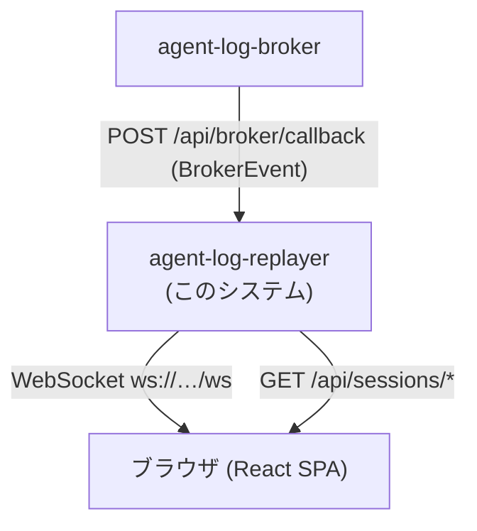

agent-log-broker はイベントの収集・パース・セキュリティ検知を担当する。replayer はそれらを**表示・再生**することのみを担当し、パース処理を持たない。

### 1.3 技術スタック

| レイヤー | 技術 |
|----------|------|
| サーバー | Node.js + Express 4 + ws 8 |
| 言語 | TypeScript 5 (ESM, NodeNext) |
| 永続化 | SQLite (better-sqlite3 11) |
| フロントエンド | React 18 + Zustand 5 + Vite 5 |
| ターミナル描画 | xterm.js 5 + xterm-addon-fit |
| ビルド/実行 | tsc + tsx (dev) |

---

## 2. 機能仕様

### 2.1 SessionList (実装済み)

ブラウザ左ペインにセッション一覧を表示する。

**表示項目:**

| 項目 | 内容 |
|------|------|
| agentType | エージェント種別 (例: `claude-code`) |
| projectPath | プロジェクトパスの末尾ディレクトリ名 |
| status | `active` / `idle` / `lost` / `archived` |
| messageCount | 受信済みメッセージ数 |
| statusColor | active=緑, idle=橙, lost=赤, archived=灰 |
| ライブインジケータ | active セッションに `●` を表示 |

**動作:**

- WebSocket 接続時に `session.list` メッセージで初期化される。
- `event` メッセージ受信時に該当セッションの `messageCount` をインクリメントし `status` を `active` に更新する。
- セッションをクリックすると選択状態になり、WebSocket に `{ type: "subscribe", sessionId }` を送信する。

**実装ファイル:** `frontend/src/components/SessionList.tsx`, `frontend/src/store/sessionStore.ts`

---

### 2.2 SessionPlayer (実装済み)

セッション選択後に表示されるリプレイプレイヤー。

**コントロール:**

| コントロール | 操作 |
|-------------|------|
| Play/Pause ボタン | 自動再生の開始・停止 |
| Prev / Next ボタン | 1 メッセージ単位のステップ移動 |
| シークバー | クリックで任意メッセージ位置にジャンプ |
| Speed スライダー | 0.25x ～ 16x (ステップ 0.25) |
| Playback Mode セレクト | `uniform` / `realtime` / `compressed` |

**キーボードショートカット:**

| キー | 動作 |
|------|------|
| `Space` | Play/Pause トグル |
| `ArrowRight` | 次のメッセージ |
| `ArrowLeft` | 前のメッセージ |
| `Home` | 先頭 (index 0) |
| `End` | 末尾 (最終メッセージ) |

**Playback Mode の定義:**

- `uniform` — 固定間隔 (800ms / speed) で自動進行。実際の発言時間差を無視する。
- `realtime` — 実際のタイムスタンプ差に基づいて進行する (現在は uniform と同一計算、TODO)。
- `compressed` — 実時間を圧縮したリプレイ (現在は uniform と同一計算、TODO)。

**内部状態 (PlaybackState):**

```typescript
interface PlaybackState {
  playing: boolean;
  currentIndex: number;  // 現在表示中のメッセージインデックス
  speed: number;         // 再生倍率
  mode: PlaybackMode;    // 再生モード
}
```

**実装ファイル:** `frontend/src/components/SessionPlayer.tsx`

---

### 2.3 TerminalView (TODO プレースホルダー)

**ステータス: 未実装**

`SessionPlayer` 内の中央ペインに配置される。`currentIndex` までのメッセージを xterm.js でターミナルスタイル描画することを意図する。

**Props:**

```typescript
interface TerminalViewProps {
  sessionId: string;
  visibleUpTo: number;  // currentIndex に対応
}
```

**未実装内容:**
- セッションストアからメッセージを取得する処理
- xterm.js の初期化とターミナルへのレンダリング
- `terminal-renderer.ts` が生成する ANSI シーケンスの適用

**現在の実装:** 静的プレースホルダーテキストを返すのみ。`sessionId` / `visibleUpTo` は未使用 (`_sessionId`, `_visibleUpTo` として受け取り)。

**実装ファイル:** `frontend/src/components/TerminalView.tsx`

---

### 2.4 TimelineView (TODO プレースホルダー)

**ステータス: 未実装**

`SessionPlayer` 内の右サイドパネル上部に配置される。`GET /api/sessions/:id/timeline` のレスポンスをもとに、縦スクロールのタイムラインを描画することを意図する。

**Props:**

```typescript
interface TimelineViewProps {
  sessionId: string;
  currentIndex: number;
  onSeek: (messageIndex: number) => void;
}
```

**未実装内容:**
- `/api/sessions/:id/timeline` からの `TimelineEvent[]` フェッチ
- タイムラインイベントの縦リスト描画
- `currentIndex` に対応するイベントのハイライト
- クリックによる `onSeek` コールバック呼び出し

**現在の実装:** legend カラーチップのみ描画。API 呼び出しなし。

**実装ファイル:** `frontend/src/components/TimelineView.tsx`

---

### 2.5 SecurityPanel (TODO プレースホルダー)

**ステータス: 未実装**

`SessionPlayer` 内の右サイドパネル下部に配置される。セッションに関連するセキュリティフラグと禁止ワードヒットを表示することを意図する。

**Props:**

```typescript
interface SecurityPanelProps {
  sessionId: string;
}
```

**未実装内容:**
- セッションストアまたは REST API からの `SecurityFlag[]` / `BannedWordHit[]` 取得
- severity 別フラグリスト (critical/warning/info)
- 禁止ワードヒット一覧
- `requiresReview()` に基づく警告バナー表示

**現在の実装:** "No security flags detected." というスタティックテキストと severity legend のみ。

**実装ファイル:** `frontend/src/components/SecurityPanel.tsx`

---

## 3. データ永続化層

### 3.1 SQLite 使用方針

- ライブラリ: `better-sqlite3` (同期 API)
- WAL モード有効 (`PRAGMA journal_mode = WAL`)
- DB ファイルパス: `DB_PATH` 環境変数 (デフォルト `./data/sessions.db`)
- ディレクトリが存在しない場合は `mkdirSync` で自動生成

**実装ファイル:** `src/storage/session-store.ts`

---

### 3.2 sessions テーブル

```sql
CREATE TABLE IF NOT EXISTS sessions (
  session_id       TEXT PRIMARY KEY,
  agent_type       TEXT NOT NULL,
  project_path     TEXT NOT NULL DEFAULT '',
  status           TEXT NOT NULL DEFAULT 'active',
  first_message_at TEXT,
  last_message_at  TEXT,
  message_count    INTEGER NOT NULL DEFAULT 0,
  created_at       TEXT NOT NULL DEFAULT (datetime('now')),
  updated_at       TEXT NOT NULL DEFAULT (datetime('now'))
);
```

`status` 有効値: `active` | `idle` | `lost` | `archived`

**upsert ロジック:**

`ON CONFLICT(session_id) DO UPDATE SET` で以下のフィールドを更新。

- `status` — 最新値で上書き
- `first_message_at` — `COALESCE(excluded.first_message_at, sessions.first_message_at)` で初回値を保持
- `last_message_at` — 最新値で上書き
- `message_count` — 最新値で上書き
- `updated_at` — `datetime('now')` で更新

---

### 3.3 messages テーブル

```sql
CREATE TABLE IF NOT EXISTS messages (
  id            INTEGER PRIMARY KEY AUTOINCREMENT,
  session_id    TEXT NOT NULL,
  message_index INTEGER NOT NULL,
  role          TEXT NOT NULL,
  text          TEXT,
  tool_uses     TEXT,         -- JSON array (nullable)
  tool_results  TEXT,         -- JSON array (nullable)
  thinking      TEXT,         -- JSON array (nullable)
  timestamp     TEXT NOT NULL DEFAULT '',
  created_at    TEXT NOT NULL DEFAULT (datetime('now')),
  FOREIGN KEY (session_id) REFERENCES sessions(session_id)
);

CREATE INDEX IF NOT EXISTS idx_messages_session
  ON messages(session_id, message_index);
```

- `tool_uses`, `tool_results`, `thinking` は JSON 文字列として格納 (非正規化)。
- `message_index` は `addMessage` 呼び出し時に `COALESCE(MAX(message_index), -1) + 1` で算出する単調増加カウンタ。
- `getMessages` は `ORDER BY message_index` で取得し、JSON フィールドをデシリアライズして `AgentMessage[]` を返す。

---

### 3.4 security_events テーブル

```sql
CREATE TABLE IF NOT EXISTS security_events (
  id            INTEGER PRIMARY KEY AUTOINCREMENT,
  session_id    TEXT NOT NULL,
  message_id    TEXT,
  message_index INTEGER,
  event_kind    TEXT,
  event_index   INTEGER,
  flag_type     TEXT NOT NULL,
  detail        TEXT,
  created_at    TEXT NOT NULL DEFAULT (datetime('now')),
  FOREIGN KEY (session_id) REFERENCES sessions(session_id)
);

CREATE INDEX IF NOT EXISTS idx_security_session
  ON security_events(session_id);

CREATE UNIQUE INDEX IF NOT EXISTS idx_security_message_event
  ON security_events(session_id, message_id, event_kind, event_index)
  WHERE message_id IS NOT NULL;
```

`message_id`・`event_kind`・`event_index` の組で broker 再送時の重複を排除する。旧スキーマには起動時の加算 migration で列を追加し、`message_id` がない旧行は保持する。

---

### 3.5 SessionStore API

| メソッド | シグネチャ | 説明 |
|----------|-----------|------|
| `upsertSession` | `(session) => void` | セッションメタデータを insert または update |
| `addMessage` | `(sessionId, message) => void` | メッセージ 1 件を追記 |
| `getMessages` | `(sessionId) => AgentMessage[]` | セッション全メッセージを取得 |
| `addSecurityEvent` | `(sessionId, messageId, messageIndex, eventKind, eventIndex, event) => boolean` | セキュリティ項目を冪等に追記。追加時のみ `true` |
| `getSecurityEvents` | `(sessionId) => StoredSecurityEvents` | セキュリティフラグ・禁止ワードヒットを復元 |
| `listSessions` | `() => StoredSession[]` | 全セッションを `updated_at DESC` で一覧 |
| `close` | `() => void` | DB 接続を閉じる |

---

## 4. ステートマシン

### 4.1 セッションライフサイクル

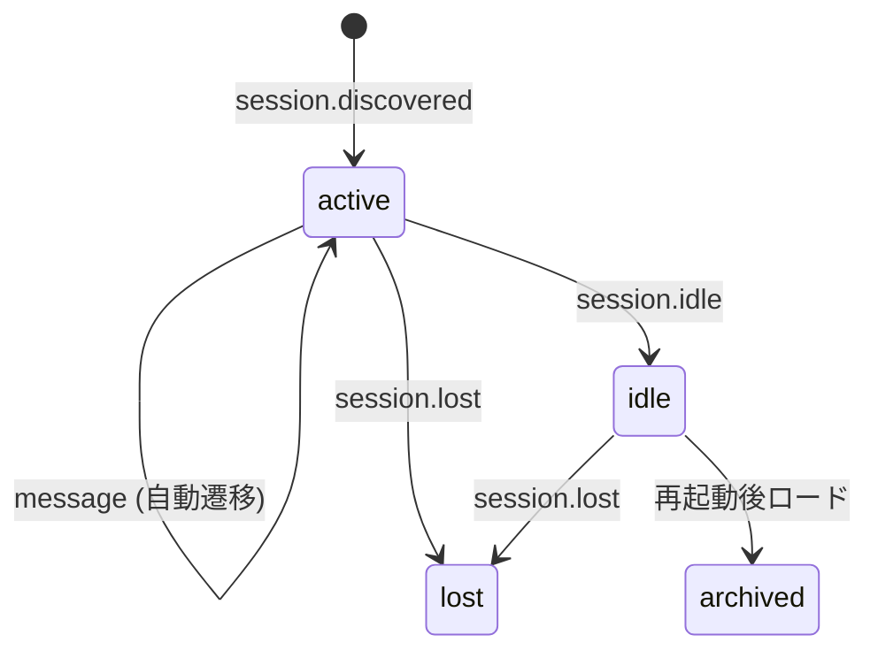

**状態遷移ルール:**

| イベント | 遷移前 | 遷移後 |
|----------|--------|--------|
| `session.discovered` | (なし) | `active` (新規作成) |
| `message` | 任意 | `active` |
| `session.idle` | `active` | `idle` |
| `session.lost` | `active` / `idle` | `lost` |
| 起動時 DB ロード | (DB 保存済み) | `archived` |

---

### 4.2 リプレイ再生ライフサイクル

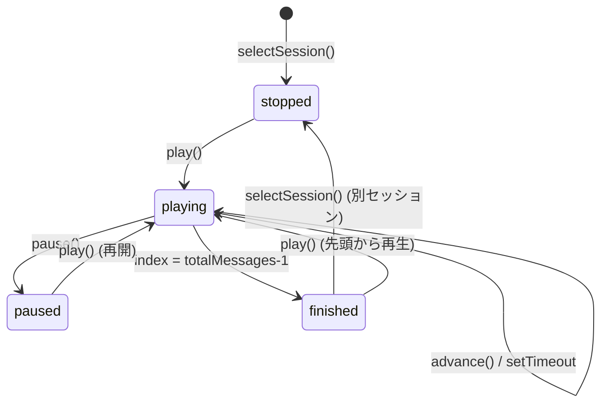

**state フィールド:** `PlaybackState.playing: boolean` + `currentIndex: number`

- `advance()` が `currentIndex >= totalMessages - 1` に達したとき `playing = false` になり `finished` 状態に相当する。
- Seek バー / Prev / Next / キーボードショートカットは `playing` 状態を `false` にしてから `currentIndex` を更新する。

---

## 5. ビジネスロジック

### 5.1 SessionManager

**責務:**

- `BrokerEvent` を受け取り、セッション状態を更新する。
- `SessionStore` を通じてメッセージを永続化する。
- 登録された `SessionEventListener` に変更を通知する。
- 起動時に `loadFromStore()` でアーカイブ済みセッションをメモリに復元する。

**handleEvent フロー:**

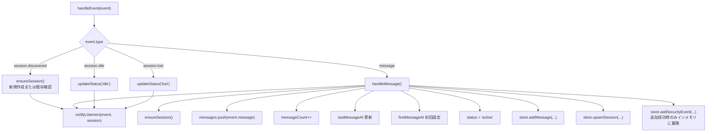

**実装ファイル:** `src/consumer/session-manager.ts`

---

### 5.2 Audit (セキュリティ監査)

**実装ファイル:** `src/security/audit.ts`

brokerが検知したセキュリティ情報の**集計・表示**を担当する。検知ロジックは持たない。

**関数:**

```typescript
// セキュリティサマリを構築する
function buildAuditSummary(
  securityFlags: unknown[],
  bannedWordHits: unknown[]
): AuditSummary

// レビュー要否を判定する
function requiresReview(summary: AuditSummary): boolean
// → criticalCount > 0 || bannedWordCount > 0 で true
```

**AuditSummary:**

```typescript
interface AuditSummary {
  totalFlags: number;
  criticalCount: number;
  warningCount: number;
  infoCount: number;
  bannedWordCount: number;
  flagsByType: Record<string, number>;
  flags: SecurityFlag[];
  bannedWordHits: BannedWordHit[];
}
```

**SecurityFlag:**

```typescript
interface SecurityFlag {
  type: string;
  severity: "info" | "warning" | "critical";
  description: string;
  messageIndex?: number;
  detail?: Record<string, unknown>;
}
```

**BannedWordHit:**

```typescript
interface BannedWordHit {
  word: string;
  context: string;
  messageIndex: number;
  field: string;
}
```

入力は `unknown[]` として受け取り、内部で `normalizeFlags` / `normalizeBannedWords` によって型安全に変換される。不明な `severity` 値は `"info"` にフォールバックする。

---

### 5.3 BrokerEvent 型二重定義問題

**ステータス: Option C Implemented (2026-08-27, issue #15)**

`BrokerEvent`, `AgentMessage`, `BrokerEnvelope`, `SessionMeta`, `IndexMeta` は `src/consumer/broker-client.ts` にローカル定義されている。agent-log-broker の正規型定義と共有パッケージが存在しないため、手動同期が必要。

**リスク:**
- broker 側でフィールド追加 → TypeScript は検知しない (サイレントな挙動変化)
- broker 側でフィールド名変更 (例: `_session` → `_sessionMeta`) → 実行時エラー

**影響ファイル:**
- `src/consumer/broker-client.ts` (定義元)
- `src/storage/session-store.ts`, `src/renderer/terminal-renderer.ts`, `src/renderer/timeline-renderer.ts` (AgentMessage インポート)
- `src/api/routes.ts`, `src/api/websocket.ts` (BrokerEvent インポート)

**解決策の選択肢:**

| オプション | 概要 | 推奨度 |
|-----------|------|--------|
| A — 共有パッケージ (`@unlaxer/agent-log-types`) | 型定義を独立パッケージに抽出、broker/replayer 双方からインポート | ★★★ |
| B — JSON Schema から型生成 | broker が JSON Schema を公開し、`json-schema-to-typescript` で生成 | ★★ |
| C — コメントによる手動同期 | `// SYNC WITH broker/src/types/broker-event.ts` を追記して人手で追跡 | ★ |

Option C を実施済み。各型に `// SYNC WITH broker/src/types/broker-event.ts` を付与し、broker 側の契約変更時に手動同期する。Option A は別リポジトリも含む将来改善。詳細: `docs/decisions/broker-event-type-duplication.md`

---

### 5.4 Renderer モジュール

**実装ファイル:** `src/renderer/`

#### terminal-renderer.ts

`AgentMessage[]` → `RenderedLine[]` に変換する。xterm.js 向け ANSI エスケープシーケンスを生成する。

**視覚規則:**

| ロール | スタイル |
|--------|---------|
| user | `\x1b[44m\x1b[1m > {text}\x1b[0m` (青背景+太字) |
| assistant (text) | `\x1b[33m  {text}\x1b[0m` (橙色) |
| tool_use | `\x1b[32m  {icon} {name}: {summary}\x1b[0m` (緑) |
| thinking | `\x1b[2m  [thinking] {truncated}\x1b[0m` (dim、デフォルト非表示) |

**オプション:**

```typescript
interface TerminalRenderOptions {
  showThinking: boolean;      // デフォルト false
  showToolDetails: boolean;   // デフォルト true
  ansiMode: "strip" | "color"; // デフォルト "strip"
}
```

**ツールアイコン対応表:**

| ツール名 | アイコン |
|----------|---------|
| Read | 📄 |
| Write | 📝 |
| Edit | ✏️ |
| Bash | `$` |
| Grep | 🔍 |
| Glob | 📁 |
| Task | 📋 |
| Agent | 🤖 |
| その他 | ⚙️ |

#### timeline-renderer.ts

`AgentMessage[]` → `TimelineEvent[]` に変換する。`GET /api/sessions/:id/timeline` で提供される。

**TimelineEvent:**

```typescript
interface TimelineEvent {
  index: number;
  timestamp: string;
  kind: TimelineEventKind;
  label: string;
  detail?: string;
  durationFromPrev: number | null;  // 前イベントからの経過 ms
  messageIndex: number;
}

type TimelineEventKind =
  | "user_message" | "assistant_message"
  | "tool_use" | "tool_result" | "thinking"
  | "session_start" | "session_idle" | "session_end";
```

1 メッセージから複数イベントが生成される (thinking ブロック、tool_use ごとに 1 イベント)。`durationFromPrev` は thinking/tool イベントでは `0` (同一 timestamp のため)。

#### diff-renderer.ts

`Edit`/`Write` ツール呼び出し入力から `FileDiff[]` を抽出する。

```typescript
interface FileDiff {
  filePath: string;
  toolName: "Edit" | "Write";
  hunks: DiffHunk[];
  isNew: boolean;  // Write の場合 true
}
```

`buildEditDiff` は old/new 全行を remove/add として並べる単純実装 (LCS による差分アルゴリズムは未使用)。

---

## 6. API / 外部境界

### 6.1 WebSocket プロトコル

**エンドポイント:** `ws://{host}/ws`

接続時、サーバーはすべてのクライアントにデフォルトで全セッションのイベントを送信する (`subscribedSessionId = null`)。

#### サーバー → クライアント

```typescript
// 接続直後に全セッション一覧を送信
{
  type: "session.list",
  sessions: SessionSummary[]
}

// broker からのイベント転送
{
  type: "event",
  sessionId: string,
  event: BrokerEvent
}

// エラー通知
{
  type: "error",
  message: string
}
```

#### クライアント → サーバー

```typescript
// 特定セッションのみ受信 (sessionId 省略 = 全セッション)
{ type: "subscribe", sessionId?: string }

// 全セッション受信モードに戻す
{ type: "unsubscribe" }
```

**フィルタリングロジック:**

```
client.subscribedSessionId === null
  → 全セッションのイベントを受信
client.subscribedSessionId === "some-id"
  → "some-id" のイベントのみ受信
```

**実装ファイル:** `src/api/websocket.ts`

---

### 6.2 REST API

**ベースパス:** `/api`

#### POST /api/broker/callback

broker から `BrokerEvent` を受信するコールバックエンドポイント。

**リクエスト:**
```json
Content-Type: application/json

{
  "_broker": { "version": "...", "messageId": "...", "deliveredAt": "...", "deliveryAttempt": 1 },
  "_session": { "sessionId": "...", "sessionPath": "...", "projectPath": "...", "agentType": "..." },
  "_index": { "messageIndex": 0, "byteOffset": 0 },
  "type": "message",
  "message": { ... }
}
```

**レスポンス:**
| ステータス | 意味 |
|-----------|------|
| 200 `{ ok: true }` | 正常受理 |
| 400 `{ error: "..." }` | 不正なイベント形式 (broker はリトライしない) |
| 500 `{ error: "..." }` | 内部エラー (broker はリトライする) |

**バリデーション:** `event._broker`, `event._session`, `event.type` のすべてが存在することを確認。

---

#### GET /api/sessions

全セッション一覧を返す (アクティブ + アーカイブ)。

**レスポンス:** `SessionSummary[]`

```typescript
interface SessionSummary {
  sessionId: string;
  agentType: string;
  projectPath: string;
  status: string;
  messageCount: number;
  firstMessageAt: string | null;
  lastMessageAt: string | null;
  hasSecurityFlags: boolean;
  hasBannedWords: boolean;
}
```

---

#### GET /api/sessions/:id

セッション詳細 (メッセージ配列を含む)。

**レスポンス:** `ActiveSession` (全フィールド)

**エラー:** 404 `{ error: "Session not found" }`

---

#### GET /api/sessions/:id/timeline

セッションのタイムラインイベント一覧。

**レスポンス:** `TimelineEvent[]` (timeline-renderer.ts による生成)

**エラー:** 404 `{ error: "Session not found" }`

---

#### GET /api/status

ヘルスチェックおよび broker 接続状態。

**レスポンス:**

```typescript
{
  replayer: "ok",
  broker: {
    connected: boolean,
    brokerUrl: string
  },
  subscribed: boolean,
  consumerId: string,
  sessionCount: number
}
```

---

### 6.3 broker サブスクリプション API

起動時に以下のリクエストを broker に送信して登録する。

**POST {BROKER_URL}/api/subscribe**

```json
{
  "consumerId": "agent-log-replayer-{timestamp}",
  "callbackUrl": "{CALLBACK_URL}",
  "mode": "full_stream"
}
```

**DELETE {BROKER_URL}/api/subscribe/{consumerId}**

`unsubscribe()` 時に送信 (現在コード上で呼び出す箇所はない)。

---

## 7. UI

### 7.1 Web UI バックエンド動作

**静的ファイル配信:**

```typescript
app.use(express.static("frontend/dist"));
```

本番ビルド (`vite build`) で `frontend/dist/` に生成された React SPA を配信する。開発時は `vite dev` で別ポートで起動し、API は別途 Express サーバーに向ける。

**SPA フォールバック:** 現在 Express には SPA 用フォールバック (`*` → `index.html`) が未設定。直接 URL アクセス時に 404 が返る可能性がある。

---

### 7.2 SessionList (§2.1 参照)

実装済み。Zustand ストア (`useSessionStore`) からセッション一覧を取得して描画する。

---

### 7.3 SessionPlayer (§2.2 参照)

実装済み。`PlaybackState` をローカル state で管理する。`currentIndex` を `TerminalView`, `TimelineView`, `SecurityPanel` に props で渡す。

---

### 7.4 TerminalView — TODO (§2.3 参照)

未実装。プレースホルダーのみ。

---

### 7.5 TimelineView — TODO (§2.4 参照)

未実装。プレースホルダーのみ。

---

### 7.6 SecurityPanel — TODO (§2.5 参照)

未実装。プレースホルダーのみ。

---

### 7.7 Zustand ストア (sessionStore.ts)

**状態:**

```typescript
interface SessionStoreState {
  sessions: SessionSummary[];
  selectedSessionId: string | null;
  connected: boolean;
  ws: WebSocket | null;
  connect: () => void;
  selectSession: (sessionId: string) => void;
  setSessions: (sessions: SessionSummary[]) => void;
}
```

**WebSocket 自動再接続:** `ws.onclose` ハンドラで 3 秒後に `connect()` を再実行する。

**既知の制限:**
- `connect()` の冪等性は `if (get().ws) return` で保証しているが、再接続後の古い ws 参照が残る可能性がある。
- `event` メッセージ受信時、セッションリストに存在しない新規セッションのイベントは無視される (`session.list` の再受信を待つ必要がある)。

---

## 8. 設定

### 8.1 環境変数

| 変数名 | デフォルト値 | 説明 |
|--------|-------------|------|
| `PORT` | `3200` | HTTP/WebSocket サーバーのポート |
| `BROKER_URL` | `http://localhost:3100` | broker エンドポイント |
| `CALLBACK_URL` | `http://localhost:3200/api/broker/callback` | broker が callback に使用する URL |
| `DB_PATH` | `./data/sessions.db` | SQLite DB ファイルパス |

`src/index.ts` の `loadConfig()` で読み込まれる。設定ファイルは存在せず、すべて環境変数。

### 8.2 broker エンドポイント設定

`BROKER_URL` は broker の HTTP API ベース URL。`BrokerClient` が以下のパスにリクエストを送信する。

- `POST {BROKER_URL}/api/subscribe` — 登録
- `DELETE {BROKER_URL}/api/subscribe/{consumerId}` — 解除
- `GET {BROKER_URL}/api/status` — 死活確認

---

## 9. 依存関係

### 9.1 broker (agent-log-broker) への依存

- **種別:** HTTP (コールバック方式)
- **結合方向:** broker → replayer (push)
- **プロトコル:** HTTP/1.1 JSON POST
- **必須要件:** broker が `POST /api/broker/callback` を呼び出せるネットワーク疎通が必要
- **耐障害性:** broker が停止していても replayer は起動可能。`subscribe()` 失敗時は警告ログのみ出力してサービスを継続する。

### 9.2 SQLite (better-sqlite3) への依存

- **種別:** 組み込み (ファイルシステム)
- **必須要件:** `DB_PATH` のディレクトリへの読み書き権限
- **耐障害性:** DB 初期化失敗時はプロセスが例外で終了する

### 9.3 フロントエンド依存 (xterm.js)

- `xterm` 5.5.0 と `xterm-addon-fit` 0.10.0 を依存に持つが、現在の `TerminalView` は xterm を未使用。
- 将来の TerminalView 実装で使用予定。

---

## 10. 非機能要件

### 10.1 テスト

**現状:** テスト 55 件 / 7 ファイル。

- `tests/` に unit test 6 ファイルと MCP E2E test 1 ファイルが存在する。
- `package.json` に `"test": "vitest"` スクリプトが定義されている。
- `vitest` は `devDependencies` に含まれている。

**対象テスト状況:**

| コンポーネント | テスト数 | 状態 |
|---------------|---------:|------|
| `session-store.ts` (SQLite CRUD) | 7 | 実装済み |
| `terminal-renderer.ts` (ANSI 生成) | 8 | 実装済み |
| `timeline-renderer.ts` (イベント生成) | 9 | 実装済み |
| `diff-renderer.ts` (差分描画) | 12 | 実装済み |
| `audit.ts` (集計ロジック) | 9 | 実装済み |
| `broker-client.ts` (consumer ID) | 2 | 一部実装済み |
| MCP E2E | 8 | 実装済み |
| `session-manager.ts` (状態遷移) | 0 | 未実装 |
| REST API エンドポイント | 0 | 未実装 |

---

### 10.2 consumerId 再起動ごと変化バグ

**ステータス: Implemented (2026-08-27, issue #10)**

`consumerId` は `CONSUMER_ID` 環境変数、`./data/consumer-id.txt`、新規 UUID の順で決定する。新規生成した ID はファイルへ保存し、次回起動時に再利用する。

```typescript
// src/consumer/broker-client.ts — 実装済み
export function getOrCreateConsumerId(idFilePath: string): string {
  if (existsSync(idFilePath)) {
    return readFileSync(idFilePath, "utf-8").trim();
  }
  const id = `agent-log-replayer-${randomUUID()}`;
  mkdirSync(dirname(idFilePath), { recursive: true });
  writeFileSync(idFilePath, id, "utf-8");
  return id;
}
```

詳細: `docs/decisions/consumer-id-instability.md`

---

### 10.3 セキュリティイベントの永続化欠落

**ステータス: Resolved (2026-08-27, issue #7)**

`SessionManager.handleMessage` はセキュリティフラグ・禁止ワードヒットを `security_events` に保存し、`loadFromStore` が再起動時に復元する。broker の `messageId` とペイロード内の位置を冪等キーに使い、同じ配信の再送は重複登録しない。

---

### 10.4 SPA フォールバック

**ステータス: Implemented (2026-08-27, issue #12)**

`frontend/dist` の静的配信後に SPA フォールバックを登録し、`/sessions/xxx` のような直接 URL を `index.html` へ解決する。未定義の `/api` パスはフォールバック対象外で 404 を維持する。

---

### 10.5 パフォーマンス特性

- `SessionStore.addMessage` は末尾インデックスを `MAX(message_index)` で取得し、セッション別インデックスを利用して追加位置を算出する。
- `SessionManager.getAllSessions()` はインメモリの `Map` を全スキャンする。セッション数が数万を超える場合はページネーションが必要。

---

## 11. テスト戦略

### 11.1 現状

テストスイートは 55 件 / 7 ファイル。ストレージ、renderer、audit、consumer ID、MCP E2E を検証している。`session-manager.ts` と REST API の統合テストは未実装。

### 11.2 推奨テスト構成

#### ユニットテスト (vitest)

**session-store.test.ts**
- `upsertSession` の insert / update 動作
- `addMessage` の message_index 採番
- `getMessages` の JSON デシリアライズ
- `listSessions` の順序

**session-manager.test.ts**
- `session.discovered` イベントでの新規セッション作成
- `message` イベントでの messageCount / timestamp 更新
- `session.idle` / `session.lost` イベントでの status 更新
- リスナー通知の確認

**audit.test.ts**
- `buildAuditSummary` の severity カウント集計
- `requiresReview` の criticalCount/bannedWordCount 判定
- 不正入力 (unknown[]) のノーマライズ

**terminal-renderer.test.ts**
- user メッセージの ANSI 出力検証
- tool_use のアイコン・サマリ出力
- thinking ブロック表示/非表示の切り替え

**timeline-renderer.test.ts**
- `buildTimeline` の event 数・kind 検証
- `durationFromPrev` の計算精度

#### 統合テスト

**broker-callback.test.ts**
- Express に対して BrokerEvent を POST し、`GET /api/sessions` でセッションが反映されることを確認
- 不正リクエストへの 400 レスポンス確認

**websocket.test.ts**
- WebSocket 接続時の `session.list` 受信
- `subscribe` メッセージ後のフィルタリング動作

### 11.3 テストデータ

broker イベントのフィクスチャを `tests/fixtures/` に配置することを推奨。

---

## 12. デプロイ / 運用

### 12.1 ビルド

```bash
# サーバーのみビルド
npm run build:server   # tsc → dist/

# フロントエンドのみビルド
npm run build:frontend # vite build → frontend/dist/

# 全体ビルド
npm run build          # tsc + vite build
```

### 12.2 起動

```bash
# 本番
node dist/index.js

# 開発 (サーバー tsx + フロントエンド vite dev)
npm run dev            # サーバー (port 3200)
npm run dev:frontend   # フロントエンド (Vite default port 5173)
```

### 12.3 必要な環境変数 (本番)

```bash
export PORT=3200
export BROKER_URL=http://<broker-host>:3100
export CALLBACK_URL=http://<replayer-host>:3200/api/broker/callback
export DB_PATH=/var/data/agent-log-replayer/sessions.db
```

`CALLBACK_URL` は broker から到達可能なアドレスである必要がある。ローカル開発では `localhost` で問題ないが、Docker / 異なるホストでは注意が必要。

### 12.4 ログ

現在はすべて `console.log` / `console.warn` / `console.error` を使用。構造化ログ (JSON lines) や外部ログ集約への対応は未実装。

### 12.5 ヘルスチェック

```
GET /api/status
```

上記エンドポイントが `{ replayer: "ok" }` を返すことを確認する。Kubernetes liveness probe / Docker HEALTHCHECK に利用できる。

### 12.6 データ管理

- SQLite ファイルをホストのボリュームにマウントして永続化する。
- `sessions.db` のバックアップ戦略は未定。
- セッション削除 API は未実装。不要なセッションの削除は SQLite CLI による手動操作が必要。

### 12.7 broker 依存の運用上の注意

- 起動時に broker への subscribe が失敗してもサービスは起動し続ける (warning ログのみ)。
- broker が再起動した場合、replayer は自動的に再登録を試みない。再起動後に `GET /api/status` で `subscribed: false` になった場合はプロセス再起動が必要。
- `consumerId` の不安定性バグ (§10.2) により、再起動のたびにステールなコンシューマが broker に蓄積する。broker 側でのクリーンアップが必要になる場合がある。

---

## 付録 A — アーキテクチャ図

### A.0 broker ← replayer アーキテクチャ

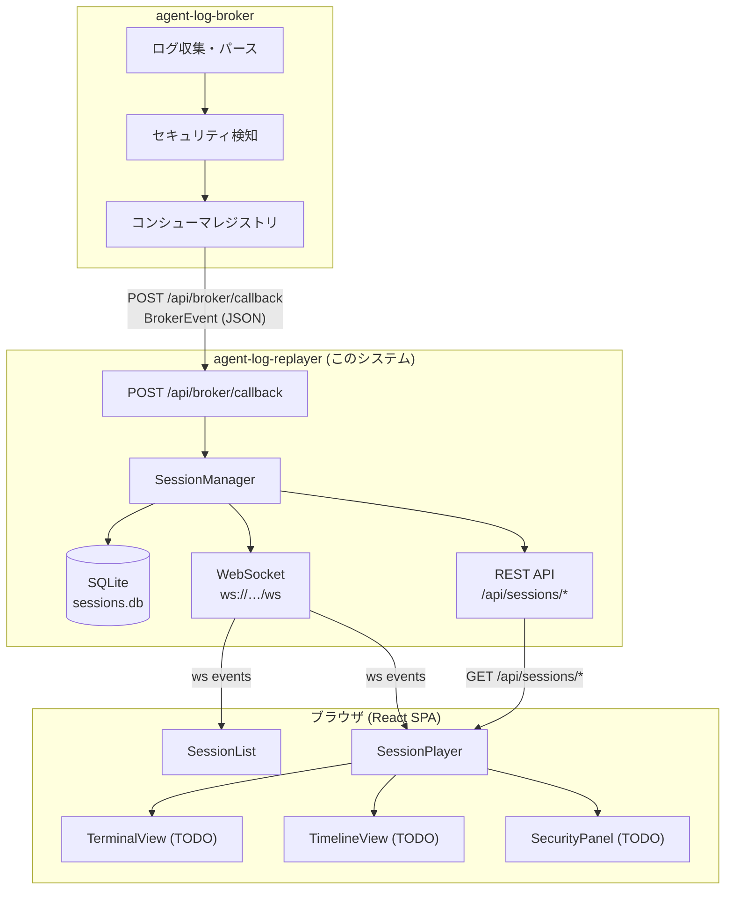

---

### A.1 HTTP コールバックフロー (sequenceDiagram)

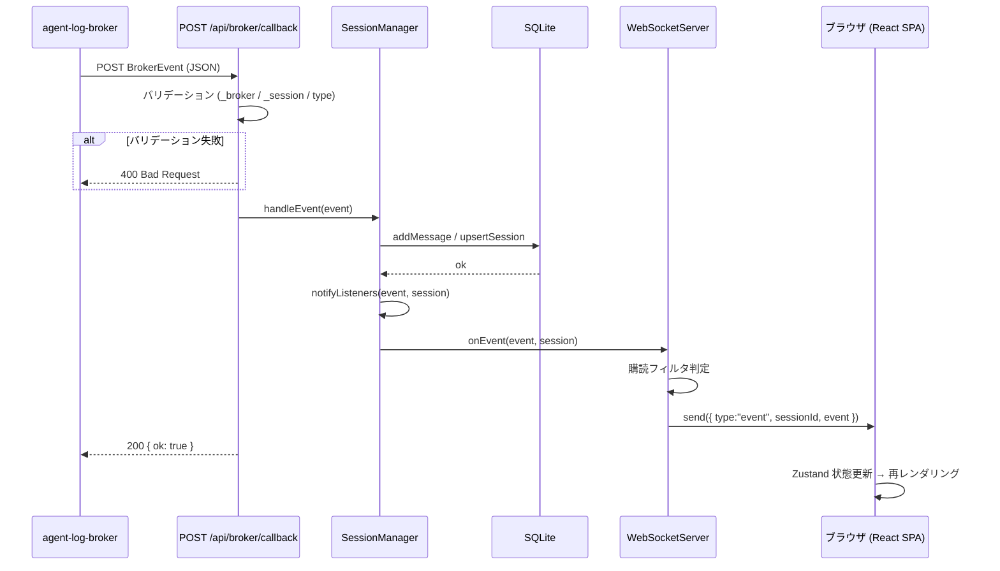

---

### A.2 リプレイ再生ライフサイクル (stateDiagram-v2)

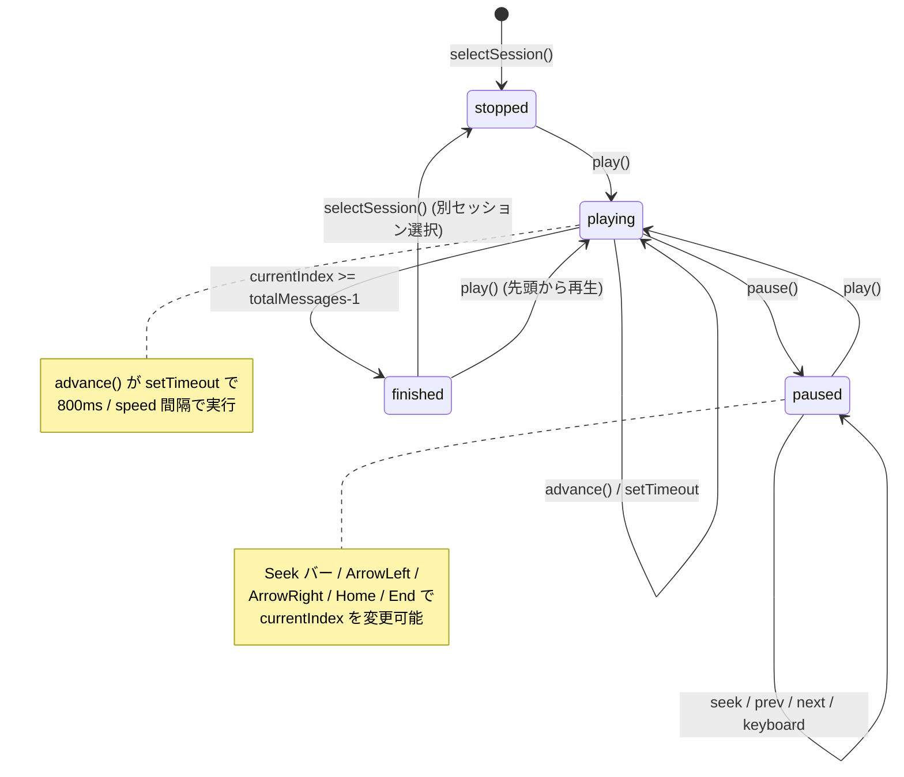

---

### A.3 SQLite ER 図 (erDiagram)

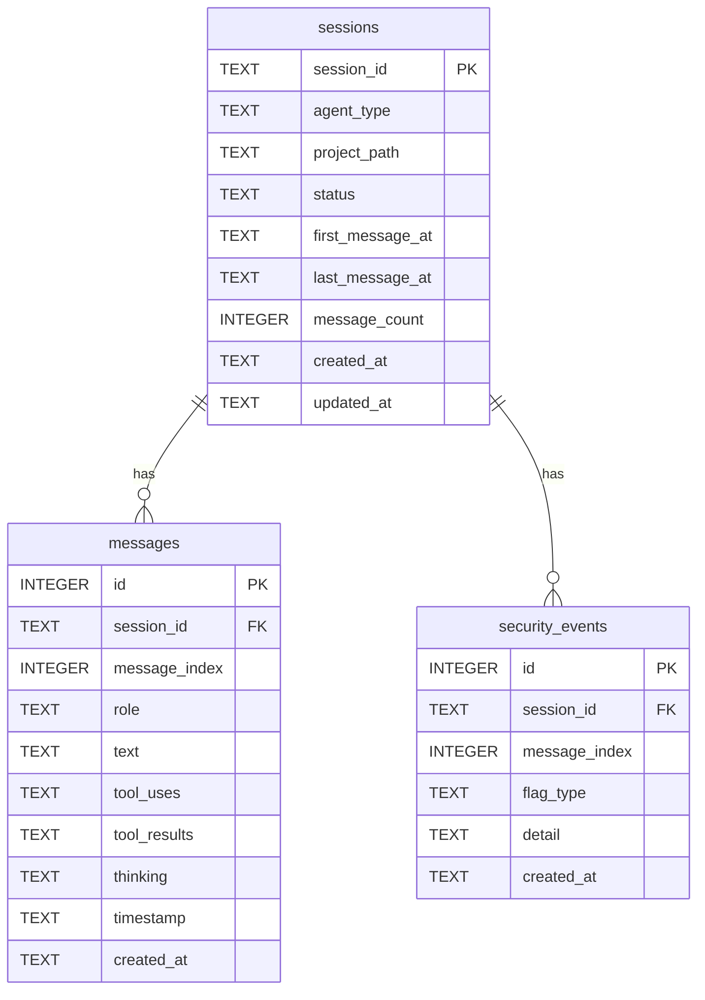

---

## 付録 B — ファイル構成マップ

```
agent-log-replayer/
├── src/
│   ├── index.ts                      # エントリポイント: Express + WS サーバー起動
│   ├── consumer/
│   │   ├── broker-client.ts          # broker HTTP サブスクリプション管理 + BrokerEvent 型定義
│   │   └── session-manager.ts        # セッションインメモリ状態 + 永続化 + リスナー通知
│   ├── renderer/
│   │   ├── terminal-renderer.ts      # AgentMessage[] → RenderedLine[] (ANSI)
│   │   ├── timeline-renderer.ts      # AgentMessage[] → TimelineEvent[]
│   │   └── diff-renderer.ts          # tool_uses → FileDiff[]
│   ├── storage/
│   │   └── session-store.ts          # SQLite CRUD (better-sqlite3)
│   ├── api/
│   │   ├── routes.ts                 # Express Router: REST エンドポイント定義
│   │   └── websocket.ts              # WebSocketServer: リアルタイム配信
│   └── security/
│       └── audit.ts                  # セキュリティフラグ集計・表示ロジック
├── frontend/
│   ├── index.html                    # Vite SPA エントリ
│   └── src/
│       ├── App.tsx                   # ルートコンポーネント (2ペインレイアウト)
│       ├── components/
│       │   ├── SessionList.tsx       # セッション一覧 (実装済み)
│       │   ├── SessionPlayer.tsx     # 再生コントロール (実装済み)
│       │   ├── TerminalView.tsx      # ターミナル描画 (TODO プレースホルダー)
│       │   ├── TimelineView.tsx      # タイムライン描画 (TODO プレースホルダー)
│       │   └── SecurityPanel.tsx     # セキュリティパネル (TODO プレースホルダー)
│       └── store/
│           └── sessionStore.ts       # Zustand: クライアント状態 + WS 管理
├── spec/
│   └── SPEC.md                       # 本仕様書
├── docs/
│   ├── architecture.md               # アーキテクチャ概要 (英語)
│   ├── architecture-ja.md            # アーキテクチャ概要 (日本語)
│   ├── getting-started.md            # 導入ガイド (英語)
│   ├── getting-started-ja.md         # 導入ガイド (日本語)
│   ├── migration-from-session-replay.md # claude-session-replay からの移行ガイド
│   └── decisions/
│       ├── broker-event-type-duplication.md  # BrokerEvent 型二重定義 ADR
│       └── consumer-id-instability.md        # consumerId 不安定性 ADR
├── tests/
│   └── .gitkeep                      # テストディレクトリ (未使用)
├── package.json
└── tsconfig.json
```

---

## 付録 C — 型定義リファレンス

### B.1 BrokerEvent 関連型 (src/consumer/broker-client.ts)

```typescript
/** broker エンベロープ — 配信メタデータ */
interface BrokerEnvelope {
  version: string;
  messageId: string;
  deliveredAt: string;
  deliveryAttempt: number;
}

/** セッションメタデータ */
interface SessionMeta {
  sessionId: string;
  sessionPath: string;
  projectPath: string;
  agentType: string;
}

/** メッセージインデックスとバイトオフセット */
interface IndexMeta {
  messageIndex: number;
  byteOffset: number;
}

/** エージェントメッセージ */
interface AgentMessage {
  role: "user" | "assistant" | "system";
  text?: string;
  toolUses?: unknown[];
  toolResults?: unknown[];
  thinking?: string[];
  timestamp: string;
}

/** broker イベント種別 */
type BrokerEventType =
  | "message"
  | "session.discovered"
  | "session.idle"
  | "session.lost";

/** broker から配信される最上位イベント */
interface BrokerEvent {
  _broker: BrokerEnvelope;
  _session: SessionMeta;
  _index?: IndexMeta;
  type: BrokerEventType;
  message?: AgentMessage;
  securityFlags?: unknown[];
  bannedWordHits?: unknown[];
}
```

### B.2 セッション状態型 (src/consumer/session-manager.ts)

```typescript
type SessionStatus = "active" | "idle" | "lost" | "archived";

interface ActiveSession {
  sessionId: string;
  agentType: string;
  projectPath: string;
  status: SessionStatus;
  messages: AgentMessage[];
  securityFlags: unknown[];
  bannedWordHits: unknown[];
  firstMessageAt: string | null;
  lastMessageAt: string | null;
  messageCount: number;
}

type SessionEventListener = (
  event: BrokerEvent,
  session: ActiveSession
) => void;
```

### B.3 ストレージ型 (src/storage/session-store.ts)

```typescript
interface StoredSession {
  sessionId: string;
  agentType: string;
  projectPath: string;
  status: string;
  firstMessageAt: string | null;
  lastMessageAt: string | null;
  messageCount: number;
  createdAt: string;
  updatedAt: string;
}
```

### B.4 BrokerClient 設定型 (src/consumer/broker-client.ts)

```typescript
interface BrokerClientConfig {
  brokerUrl: string;
  callbackUrl: string;
  consumerId?: string;  // entry point は env/file/generate で永続 ID を渡す
}
```

### B.5 ServerConfig 型 (src/index.ts)

```typescript
interface ServerConfig {
  port: number;
  brokerUrl: string;
  callbackUrl: string;
  dbPath: string;
  consumerId?: string;
}
```

---

## 付録 D — 既知の問題一覧 (BACKLOG)

| ID | 説明 | 優先度 | 影響ファイル | 状態 |
|----|------|--------|-------------|------|
| BUG-001 | consumerId 再起動ごと変化 → broker にステール登録が蓄積 | 中 | `src/consumer/broker-client.ts` | Resolved (#10) |
| BUG-002 | security_events テーブルに書き込みが行われない → 再起動でセキュリティデータ消失 | 中 | `src/consumer/session-manager.ts`, `src/storage/session-store.ts` | Resolved (#7) |
| BUG-003 | SPA フォールバック (`* → index.html`) が未設定 → 直接 URL アクセスで 404 | 低 | `src/index.ts` | Resolved (#12) |
| BUG-004 | realtime / compressed playback mode が uniform と同一動作 | 低 | `frontend/src/components/SessionPlayer.tsx` | Open (#13) |
| TODO-001 | TerminalView の xterm.js 統合 | 高 | `frontend/src/components/TerminalView.tsx` | Open (#9) |
| TODO-002 | TimelineView のタイムラインフェッチ・描画 | 高 | `frontend/src/components/TimelineView.tsx` | Open (#9) |
| TODO-003 | SecurityPanel のセキュリティデータ表示 | 中 | `frontend/src/components/SecurityPanel.tsx` | Open (#9) |
| TODO-004 | テストスイートの整備 | 高 | `tests/` | 55件 / 7ファイル (#5) |
| TECH-001 | BrokerEvent 型二重定義 → 共有パッケージまたは型生成へ移行 | 中 | `src/consumer/broker-client.ts` | Option C implemented (#15) |
| TECH-002 | broker 再起動後の自動再サブスクライブ機能 | 低 | `src/consumer/broker-client.ts`, `src/index.ts` | Open (#18) |
| TECH-003 | `addMessage` の message_index 採番に `COUNT(*)`使用 → 大量メッセージ時のパフォーマンス劣化 | 低 | `src/storage/session-store.ts` | Resolved (#16) |
| TECH-004 | セッション削除 API の未実装 → DB の手動管理が必要 | 低 | `src/api/routes.ts`, `src/storage/session-store.ts` | Open (#19) |
| TECH-005 | `loadFromStore()` が `main()` から未呼び出し | 中 | `src/index.ts` | Resolved (#8) |

---

## 付録 E — データフロー詳細

### D.1 メッセージ受信から WebSocket 配信までのフロー

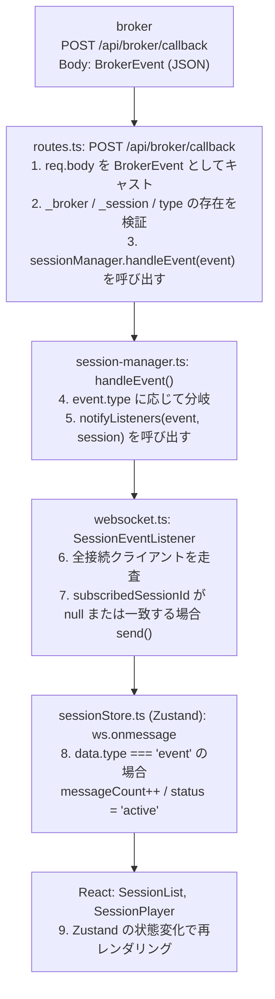

### D.2 メッセージ永続化フロー

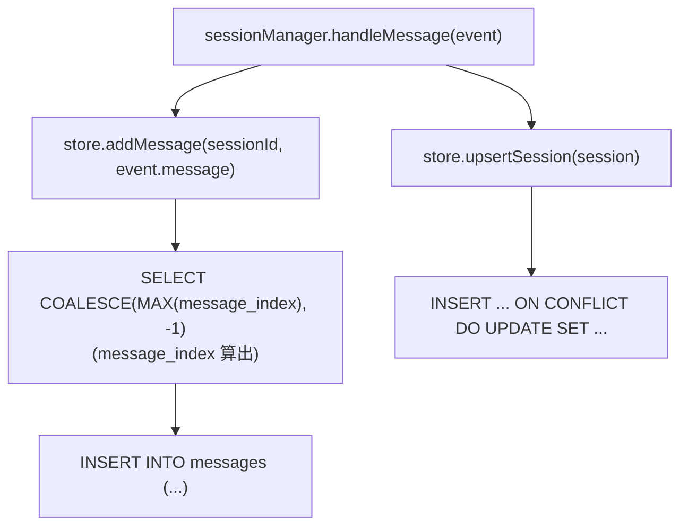

### D.3 起動時のセッション復元フロー

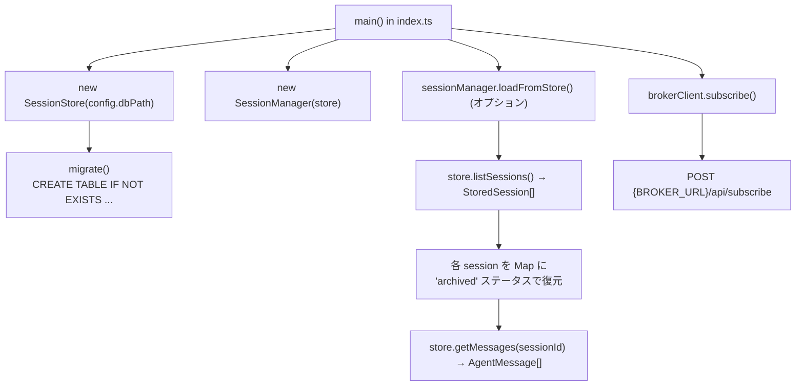

**注記:** `loadFromStore()` は `main()` 内で broker subscribe より前に呼び出される。SQLite の既存セッションは起動時に `archived` ステータスでメモリへ復元される (issue #8)。

---

## 付録 F — 開発ガイド

### E.1 ローカル開発環境セットアップ

```bash
# 依存インストール
npm install

# TypeScript ビルド (サーバー)
npm run build:server

# フロントエンドビルド
npm run build:frontend

# 開発サーバー起動 (tsx でホットリロード不可、変更時は再起動が必要)
npm run dev

# 別ターミナルでフロントエンド開発サーバー
npm run dev:frontend
```

### E.2 broker なしでの動作確認

broker が存在しない環境では `POST /api/broker/callback` に直接 JSON を送信して動作確認できる。

```bash
# セッション発見イベントのシミュレーション
curl -X POST http://localhost:3200/api/broker/callback \
  -H "Content-Type: application/json" \
  -d '{
    "_broker": { "version": "1", "messageId": "m1", "deliveredAt": "2026-04-19T00:00:00Z", "deliveryAttempt": 1 },
    "_session": { "sessionId": "test-session-1", "sessionPath": "/tmp/s", "projectPath": "/home/user/project", "agentType": "claude-code" },
    "type": "session.discovered"
  }'

# メッセージイベントのシミュレーション
curl -X POST http://localhost:3200/api/broker/callback \
  -H "Content-Type: application/json" \
  -d '{
    "_broker": { "version": "1", "messageId": "m2", "deliveredAt": "2026-04-19T00:00:01Z", "deliveryAttempt": 1 },
    "_session": { "sessionId": "test-session-1", "sessionPath": "/tmp/s", "projectPath": "/home/user/project", "agentType": "claude-code" },
    "_index": { "messageIndex": 0, "byteOffset": 0 },
    "type": "message",
    "message": {
      "role": "user",
      "text": "このファイルを読んでください",
      "timestamp": "2026-04-19T00:00:01Z"
    }
  }'

# セッション一覧確認
curl http://localhost:3200/api/sessions | jq .

# ステータス確認
curl http://localhost:3200/api/status | jq .
```

### E.3 TypeScript コンパイルチェック

```bash
# 型エラー確認のみ (出力なし)
npx tsc --noEmit

# フロントエンドの型チェック (tsconfig が別の場合)
cd frontend && npx tsc --noEmit
```

### E.4 新しい BrokerEventType の追加手順

broker が新しいイベント種別 (例: `session.resumed`) を追加した場合、以下のファイルを更新する必要がある。

1. `src/consumer/broker-client.ts` — `BrokerEventType` union 型に追加
2. `src/consumer/session-manager.ts` — `handleEvent()` の switch 文に case 追加
3. 必要に応じて新しい状態遷移ロジックを `SessionManager` に実装

---

## 付録 G — セキュリティ考慮事項

### F.1 broker callback エンドポイントの認証

現在、`POST /api/broker/callback` に認証機構が存在しない。任意のクライアントが偽の `BrokerEvent` を送信できる。

**推奨対策:** broker との間で共有シークレット (HMAC 署名) を用いて callback リクエストを検証する。例:

```typescript
// リクエストヘッダー: X-Broker-Signature: hmac-sha256(secret, body)
const sig = req.headers["x-broker-signature"];
const expected = computeHmac(process.env.BROKER_SECRET, rawBody);
if (sig !== expected) {
  res.status(401).json({ error: "Unauthorized" });
  return;
}
```

### F.2 SQLite ファイルのアクセス制御

`DB_PATH` のファイルにはセッション内容 (プロンプト・応答全文) が格納される。ファイルパーミッションを適切に設定し、不要なプロセスからのアクセスを防ぐこと。

### F.3 WebSocket の認証

現在 WebSocket 接続に認証機構が存在しない。ポートが公開されている場合、任意のブラウザから接続してセッション内容を閲覧できる。ローカル環境 (`localhost`) での使用を前提とした設計。

本番環境で公開する場合は、Express セッション認証または JWT ベースの WebSocket ハンドシェイク検証を実装すること。

### F.4 セキュリティフラグの信頼性

`securityFlags` / `bannedWordHits` は broker が検知して replayer に渡す。replayer は再検知を行わない。broker の検知精度・設定に依存するため、replayer の SecurityPanel に表示されるデータはあくまで broker の判定結果であることに留意する。

---

## 付録 H — 用語集

| 用語 | 定義 |
|------|------|
| **broker** | agent-log-broker。LLM エージェントのログを収集・パース・配信する中間サービス |
| **consumer** | broker に登録してイベントを受け取るサービス。agent-log-replayer は consumer の一つ |
| **consumerId** | broker がコンシューマを識別するための文字列 ID |
| **BrokerEvent** | broker が配信するイベントの最上位型。`_broker`, `_session`, `type` を必須フィールドとして持つ |
| **BrokerEnvelope** | `_broker` フィールド。配信メタデータ (messageId, deliveredAt, deliveryAttempt など) |
| **SessionMeta** | `_session` フィールド。セッション識別情報 (sessionId, projectPath, agentType など) |
| **AgentMessage** | LLM エージェントの 1 メッセージ。role + text + toolUses + toolResults + thinking を持つ |
| **full_stream** | broker のサブスクリプションモード。すべてのイベントをリアルタイムで配信する |
| **ActiveSession** | インメモリのセッション表現。messages 配列を含む |
| **StoredSession** | SQLite に永続化されたセッション表現。messages を含まないメタデータのみ |
| **RenderedLine** | terminal-renderer が生成する ANSI 付き 1 行の表現 |
| **TimelineEvent** | timeline-renderer が生成するタイムライン 1 イベントの表現 |
| **FileDiff** | diff-renderer が生成するファイル差分の表現 |
| **AuditSummary** | audit.ts が生成するセキュリティサマリの表現 |
| **SessionPlayer** | ブラウザ上のリプレイプレイヤーコンポーネント |
| **currentIndex** | SessionPlayer が管理する「現在再生中のメッセージインデックス」 |
| **visibleUpTo** | TerminalView に渡される「表示対象の最大メッセージインデックス」 |
| **WAL** | SQLite の Write-Ahead Logging モード。並行読み書きのパフォーマンスを向上させる |
| **xterm.js** | ブラウザ上で動作するターミナルエミュレータライブラリ。TerminalView で使用予定 |
| **Zustand** | React 向け軽量状態管理ライブラリ。sessionStore.ts で使用 |
| **Vite** | フロントエンドビルドツール。dev サーバーと本番バンドルを提供 |
| **tsx** | TypeScript ファイルを直接実行するツール。開発時の `npm run dev` で使用 |
| **ANSI エスケープシーケンス** | ターミナル制御コード。文字色・背景色・装飾を制御する |

---

## 付録 I — 変更履歴

| バージョン | 日付 | 変更内容 |
|-----------|------|---------|
| 0.1.0 | 2026-04-19 | 初版作成。12 セクション + 付録 A〜G |
| 0.1.1 | 2026-04-19 | 付録 A にアーキテクチャ図 (graph TB / sequenceDiagram / stateDiagram-v2 / erDiagram) を追加。旧付録 A〜G を B〜I に繰り下げ |
